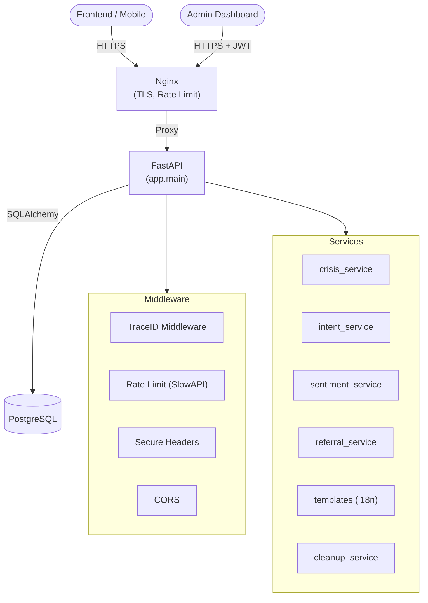

# Architecture Overview

## System Summary

Smart-Mental is an anonymous mental health screening API built with FastAPI + PostgreSQL. It provides PHQ-9/GAD-7 scoring, a safety layer for crisis detection, a guided chatbot, referrals to mental health resources, multilingual support (English + Nigerian Pidgin), and admin analytics — all without collecting any personally identifiable information.

---

## Module Responsibilities

| Module | Path | Responsibility |
|--------|------|----------------|
| Sessions | `app/api/v1/endpoints/sessions.py` | Create anonymous session tokens (hashed), manage expiry |
| Consents | `app/api/v1/endpoints/sessions.py` | Record policy acceptance before assessments |
| Questionnaires | `app/api/v1/endpoints/questionnaires.py` | Serve PHQ-9 / GAD-7 questions with language support |
| Assessments | `app/api/v1/endpoints/assessments.py` | Score submissions, detect self-harm flags, trigger safety layer |
| Safety Layer | `app/services/crisis_service.py` | Dual-signal crisis evaluation (flags + chat keywords); logs to `safety_events` |
| Resources | `app/api/v1/endpoints/resources.py` | Public directory of verified clinics/hotlines; admin CRUD |
| Referrals | `app/services/referral_service.py` | Rules-based risk→resource matching |
| Chat | `app/api/v1/endpoints/chats.py` | Crisis→intent→multilingual template pipeline |
| Intent Detection | `app/services/intent_service.py` | Keyword-based message classifier (results/resources/coping/general) |
| Multilingual | `app/core/templates.py` | Response templates for EN + Pidgin per intent |
| Sentiment | `app/services/sentiment_service.py` | Lexicon-based scorer; rolling stats (streak, volatility) |
| Admin Auth | `app/api/v1/endpoints/admin_auth.py` | JWT-protected admin login |
| Analytics | `app/api/v1/endpoints/analytics.py` | Aggregate session/assessment/severity metrics |
| Exports | `app/api/v1/endpoints/exports.py` | Anonymized data export for thesis / audit |
| Cleanup | `app/services/cleanup_service.py` | NDPR data retention — deletes expired sessions |

---

## System Architecture



---

## Request Flow (Chat Message)

```
User → POST /api/v1/chats/{id}/message
  ↓ Middleware (trace_id, CORS, rate limit, secure headers)
  ↓ Validate X-Session-Token
  ↓ Persist user ChatMessage (language_original stored)
  ↓ crisis_service.evaluate(user_text)
      → high:  return crisis-safe response + hotlines, log SafetyEvent
      → watch: return gentle check-in response, log SafetyEvent
      → none:  continue ↓
  ↓ intent_service.detect_intent(text)
      → resources_request: call referral_service → fetch DB resources
      → results_explain:   fetch latest Assessment for session
      → coping_tips:       template
      → general_support:   template
  ↓ templates.get_template(intent, lang) → localised response string
  ↓ sentiment_service.analyse(text) → write SentimentEvent
  ↓ Persist AI ChatMessage
  ↓ Return [user_msg, ai_msg]
```
